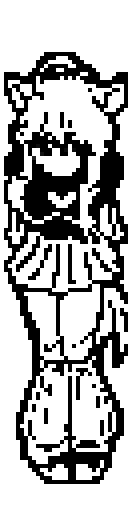
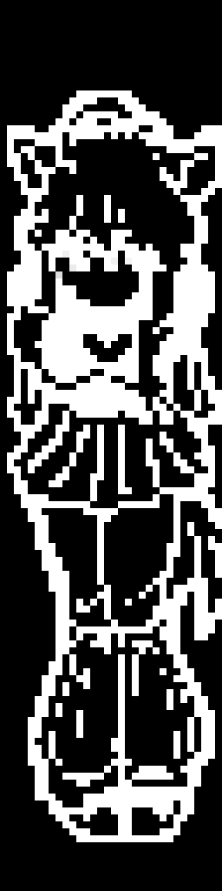

## Anime Animations for QMK Firmware
When I first built my Corne, I couldn't find any anime animations for it. And what's the point in having OLED displays if you can't display anime girls on them? FR FR.
Shout out to my sister for making this animation.

Made specifically for 32x128 OLED displays, like the ones in crkbd v3.
Feel free to use them.

If you have any other anime animations and want to share them, I would appreciate pull requests!

### Niunia classic:

### Niunia neg:

